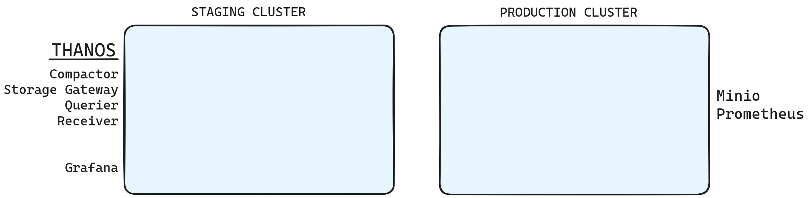
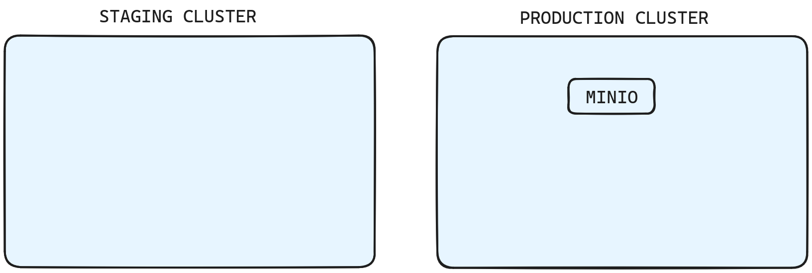
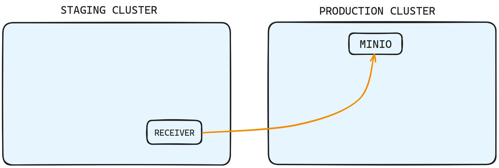
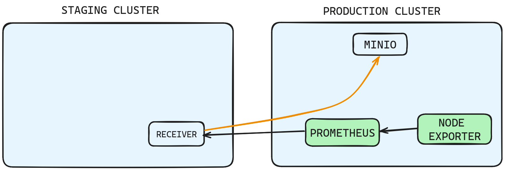
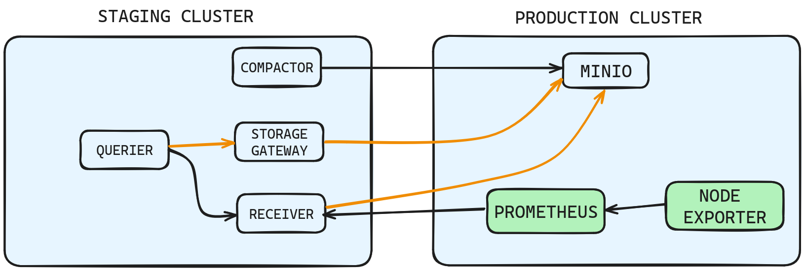
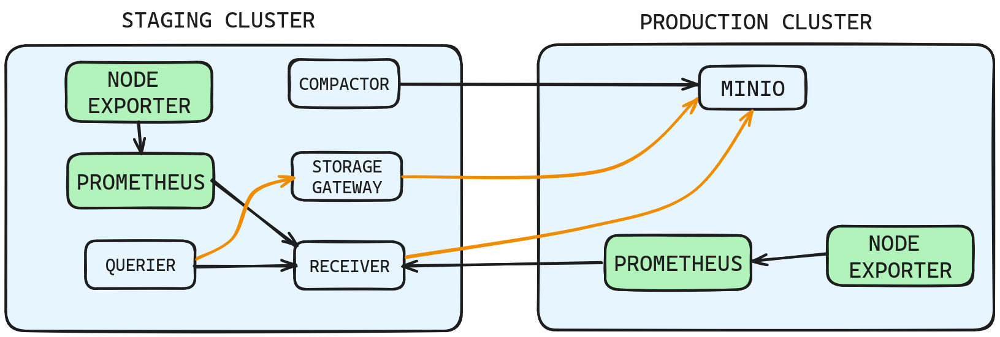
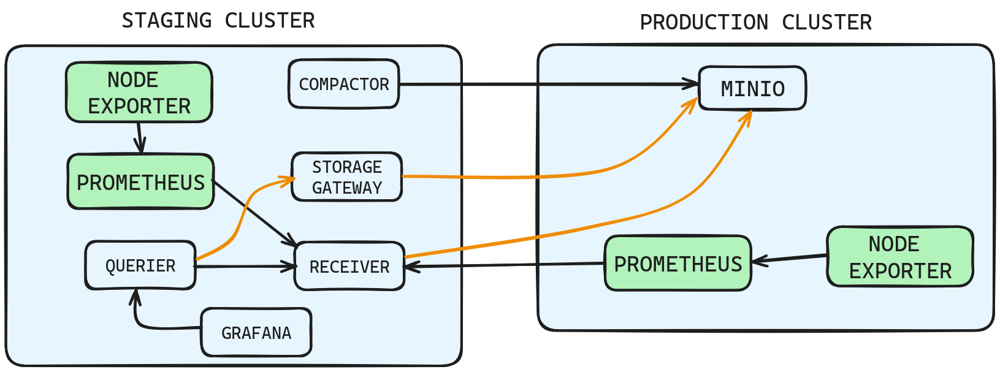

# *Kubernetes Multi-Cluster Monitoring With Prometheus, Thanos & Grafana*

  
## Prerequisites

  
To be able to smoothly perform this workshop make sure your machine contains required software packages.
  

**1. awscli v2** (Version: aws-cli/2.15.45 Preffered )

[https://docs.aws.amazon.com/cli/latest/userguide/getting-started-install.html](https://docs.aws.amazon.com/cli/latest/userguide/getting-started-install.html)
  

**2. Kubectl**

[https://kubernetes.io/docs/tasks/tools/](https://kubernetes.io/docs/tasks/tools/)

[https://kubernetes.io/docs/tasks/tools/install-kubectl-linux/](https://kubernetes.io/docs/tasks/tools/install-kubectl-linux/)

# Steps:

## Step 1: Adding The Cluster

1. Authenticate with the AWS account

  
    `aws configure`

2. Add EKS cluster config

    `aws eks update-kubeconfig --region ap-south-1 --name $CLUSTER_NAME`  

**OUTPUT:**

  
  
## Step 2: Create Object Storage *(production cluster)*

**OUTPUT:**

## Step 3: Create Thanos Component Receiver *(staging cluster)*

**OUTPUT:**

## Step 4: Create Prometheus And Node Exporter *(production cluster)*

**OUTPUT:**

## Step 5: Create All Thanos Components *(staging cluster)*

**OUTPUT:**

**Verify**

`count by(instance)(node_cpu_seconds_total)`

## Step 6: Create Prometheus *(staging cluster)*

**OUTPUT:**

## Step 7: Create Grafana *(staging cluster)*

**OUTPUT:**

